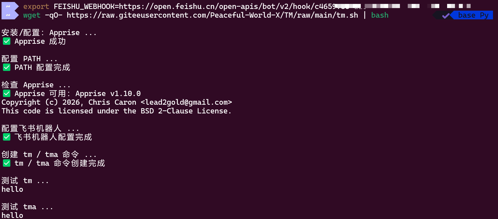
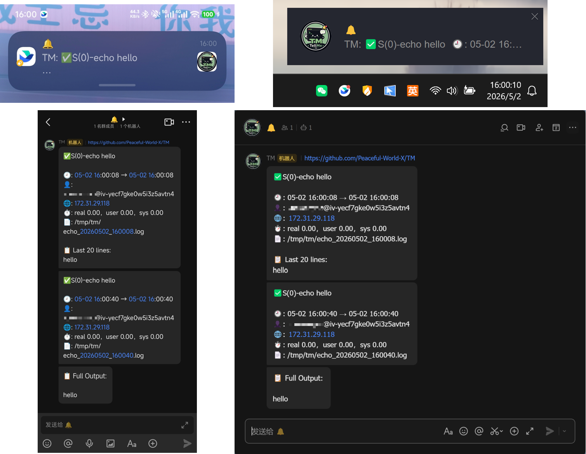

<p align="center">
  
</p>

<p align="center">
  
  
  
  
  
  
</p>

<p align="center">
  
</p>

<h1 align="center">TellMe (TM) 🔔</h1>

<p align="center">
  <b>
    <span style="color:#00C853;">TM</span> /
    <span style="color:#2979FF;">Tell Me</span> /
    <span style="color:#FF6D00;">Terminal Messenger</span>
  </b>
  终端命令通知工具：<code>tm &lt;命令&gt;</code>。
</p>


## 一行代码安装

1. 精简流程：(电脑端)群设置 → `群机器人` →  `添加机器人` → `自定义机器人` → `添加` → `复制 Webhook 链接`。
[飞书自定义机器人详细教程](https://open.feishu.cn/document/client-docs/bot-v3/add-custom-bot)

1. 安装脚本：
    ```bash
    export FEISHU_WEBHOOK=   # 'https://open.feishu.cn/open-apis/bot/v2/hook/your_key'

    wget -qO- https://raw.giteeusercontent.com/Peaceful-World-X/TM/raw/main/tm.sh | bash
    ```

安装完成后会创建两个命令：

```bash
tm   # 发送任务信息 + 最后 20 行输出
tma  # 先发送任务信息，再单独发送完整输出
```

## Usage

```bash
tm echo hello
tm sleep 10 && echo done
tma ip -c a

```

如果命令中包含管道、重定向、`&&` 等 Shell 语法，请使用引号：

```bash
tm 'python train.py 2>&1 | tee train.log'
```


## Logs

日志格式：`/tmp/tm/<first_command_word>_<timestamp>.log`

## Help

```bash
tm -h
tma -h
```


## Dependence

TM 会自动安装并使用：
- Bash
- Python3
- Apprise

Apprise 用于统一发送通知，当前默认配置为飞书机器人，也可设置为其他支持的通知渠道，详细查看 https://appriseit.com/services。

## Uninstall

```bash
rm -f "$HOME/.local/bin/tm" "$HOME/.local/bin/tma" "$HOME/.local/bin/tm_core" "$HOME/.config/apprise.conf" && rm -rf /tmp/tm
```

## Demo
### Install


# News
```bash
tm echo hello
tma echo hello
```

